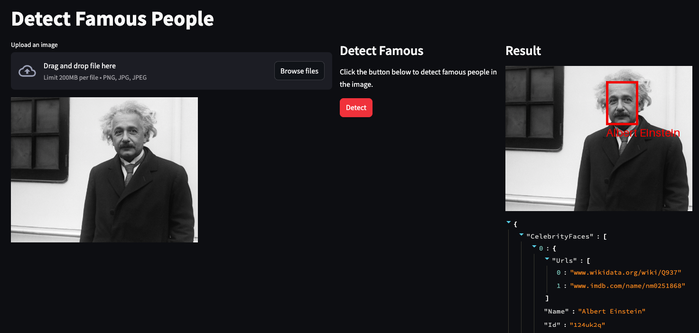

# AWS-REKOGNITION-DEMO

Example of multiple projects that leverage AWS Rekognition for building top notch Image-Driven solutions on AWS.

## WORK IN PROGRESS... 👷‍♂️

## Image Detect Famous

This project allows you to upload any image, and obtain the celebrities present in the input photo.

 <br>

### How to run this project?

Clone the repository:

```bash
git clone https://github.com/san99tiago/aws-rekognition-demo
cd aws-rekognition-demo
```

Then, proceed to install the necessary dependencies:

```bash
# Install Poetry and Python dependencies
pip install poetry
poetry shell
poetry install
```

Afterwards, configure the AWS Credentials locally and add the S3 Bucket that you will use for the demo (note: the bucket must be created and it must have the required permissions already):

```bash
# Replace the values with the ones accordingly to your AWS Account...
export S3_BUCKET="your-bucket-name-goes-here"
export AWS_ACCESS_KEY_ID="paste-your-access-key"
export AWS_SECRET_ACCESS_KEY="paste-your-secret-access-key"
export AWS_SESSION_TOKEN="paste-your-session-token"
```

Finally, proceed to run the application as follows:

```bash
streamlit run  src/image_detect_famous/image_detect_famous_app.py --server.port 8080
```

Enjoy!

## LICENSE

Copyright 2024 Santiago Garcia Arango

Copyright 2024 Santiago Castellanos
